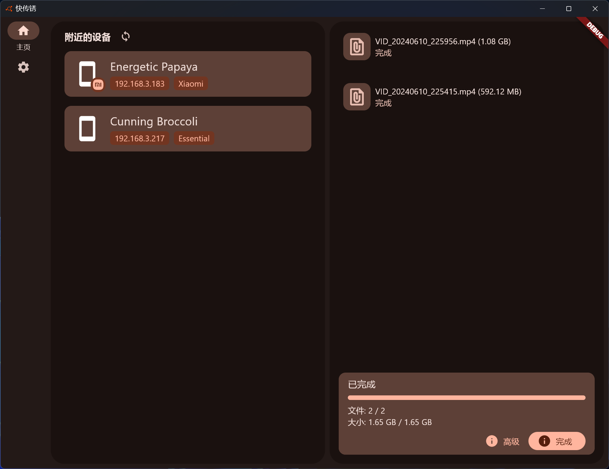

# localsend_rs


[](https://github.com/tom8zds/localsend_rs/actions/workflows/build.yml) 

WIP: this repository is still WIP. 

A localsend protocol V2 implementation in flutter and rust for better performance.

## Screen shots



## Performance

Performance compare between localsend original and localsend_rs

Test condition : 

 - router: TpLink AX3000M
 - sender: Xiaomi 13 ( localsend )
 - receiver: Windows PC ( localsend_rs / localsend )

| sender    | receiver     | network speed | disk speed |
| --------- | ------------ | ------------- | ---------- |
| localsend | localsend    | 144Mbps       | 26MB/s     |
| localsend | localsend_rs | 511Mbps       | 102M/s     |

## Roadmap

- [ ] Protocol V2
    - [x] Udp announce
    - [x] Register
    - [x] Prepare upload
    - [x] Upload
    - [ ] Cancel
    - [ ] Send
- [ ] User interface
    - [ ] discover page
      - [x] device list
      - [ ] device favorite
    - [x] receive page
      - [x] task progress
      - [ ] pic preview
      - [ ] mission progress
    - [ ] send page
    - [ ] setting page
      - [x] theme setting
      - [x] locale setting
      - [x] server setting
        - [x] start / stop
        - [ ] server config
        - [x] save directory
        - [ ] save pic to album
        - [ ] save to history
- [x] Platform
  - [x] Windows
  - [x] Android
  - [ ] linux

## Relay invite deep links

Relay configuration can be shared as a deep link:

```
localsend-relay://configure?addr=host:port&secret=xxx
```

Opening such a link (or scanning its QR code) shows a confirmation
dialog; confirming writes the address and secret into the relay
settings. The scheme is registered automatically on Android
(`AndroidManifest.xml`), iOS/macOS (`CFBundleURLTypes`) and by the
Windows installer (`[Registry]` section in `setup.dart`).

### Linux (manual registration)

The Flutter Linux build has no `.desktop` template in this repository
(the Flutter tool generates the launcher entry at build time), so the
`x-scheme-handler/localsend-relay` association must be registered by
hand — once per user:

1. Create `~/.local/share/applications/localsend-relay.desktop` next
   to the app's own launcher entry (adjust `Exec` to where the app is
   installed):

   ```ini
   [Desktop Entry]
   Type=Application
   Name=localsend_rs
   Exec=/path/to/localsend_rs %u
   NoDisplay=true
   MimeType=x-scheme-handler/localsend-relay;
   ```

2. Refresh the handler cache:

   ```sh
   update-desktop-database ~/.local/share/applications
   ```

Afterwards, opening a `localsend-relay://` link (e.g. `xdg-open
'localsend-relay://configure?addr=example.com:3478&secret=s'`) starts
the app or hands the link to the already-running instance.

## Getting Started

This project is a starting point for a Flutter application.

A few resources to get you started if this is your first Flutter project:

- [Lab: Write your first Flutter app](https://docs.flutter.dev/get-started/codelab)
- [Cookbook: Useful Flutter samples](https://docs.flutter.dev/cookbook)

For help getting started with Flutter development, view the
[online documentation](https://docs.flutter.dev/), which offers tutorials,
samples, guidance on mobile development, and a full API reference.
